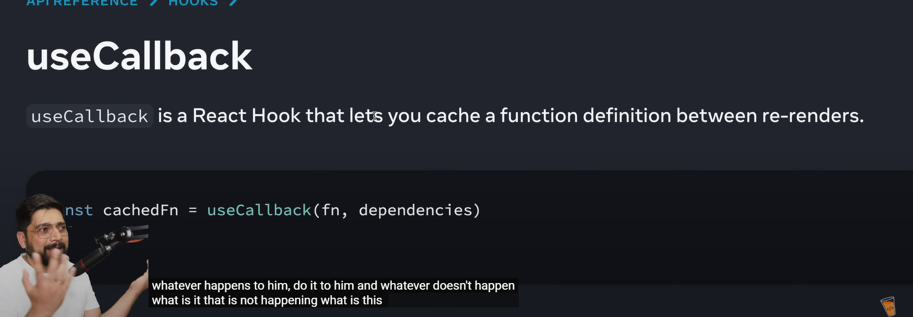

### ✅ Browser handles basic functionality:

- You don’t need JavaScript just to make a slider or checkbox.
- But **React** and **JavaScript** give you full **control over behavior and styling** .

In React, the `onChange` event is used to handle user input in form elements such as `<input>`, `<textarea>`, and `<select>`. It is triggered every time the value of the element changes.

#### Without `useCallback`:

If you don't use `useCallback`, React will **create a fresh instance** of `passwordGenerator` every time the component re-renders. This doesn't impact your password directly, but it's **unnecessary overhead** (extra work) that can slow down your app, especially if the component re-renders frequently.

#### With `useCallback`:

When you use `useCallback`, **React remembers the function** (like `passwordGenerator`) and **only recreates it if the settings** (like `length`, `numbersAllowed`, etc.) change. This helps **avoid unnecessary recreations** of the function, making the app more efficient.

### Example to Illustrate:

- **Without `useCallback`** : Every time something changes (e.g., you update the length), the function `passwordGenerator` is recreated, and React has to **reset the logic** even if nothing changed.
- **With `useCallback`** : React **remembers** the function as long as the settings haven't changed. This way, the logic (the function itself) stays the same unless the settings really need to change.

this project can be made wihtout usecallback also.

### **Memoization and Optimization** :

React's `useCallback` hook helps with **memoizing functions** to avoid unnecessary re-creations of those functions on every re-render. When `setPassword` is included in the dependency array, it’s basically telling React, **"if `setPassword` changes, we’ll need to recreate the `passwordGenerator` function"** .

- **Why?** Because if the setter function were to change (in certain advanced scenarios), React needs to know so that the function can use the **latest reference** for state updates.
- **But React won't change `setPassword` in typical use cases** , so this inclusion is mainly for **compliance** and **safety** in complex scenarios or in case the rules of React change.

### 4. **Final Outcome** :

- **`setPassword` is stable** in your code, and it's **not necessary to include it** in the dependency array in most cases.
- Including it won’t hurt, but it’s mainly there because React requires you to declare everything used inside `useCallback` to be in the dependency array.
